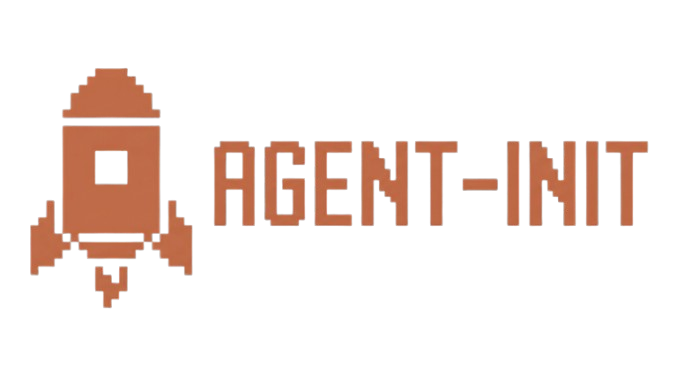

<p align="center">
  
</p>

A lightweight package manager for your AI-assistant tooling: skills, sub-agents, MCP servers, rules, and plugins — version-pinned and tracked in your repo.

## Contents

- [Why this exists](#why-this-exists)
- [Features](#features)
- [Installation](#installation)
- [Demo](#demo)
- [Quick start](#quick-start)
- [How it works](#how-it-works)
- [Governance & risk scanning](#governance--risk-scanning)
- [Development](#development)
- [Contributing](#contributing)

## Why this exists

Every AI coding assistant works better with the right context: project conventions, reusable rules, and curated tools. Today that context is scattered across copy-pasted prompts, hand-edited `CLAUDE.md` files, and git submodules nobody wants to maintain.

`aim` turns that into a reproducible workflow. It installs versioned skills, agents, rules, MCP servers, and plugins from any git repo or registry, and scaffolds the agent instruction file your IDE expects. Everything is recorded in your project so the setup survives a fresh clone.

## Features

- **Scaffold an opinionated `AGENTS.md`** — `init` renders the agent instruction file from a template (a bundled set of behavioral guidelines by default, or one you pick) and keeps only its `aim:` marker regions in sync, so your edits outside them survive. Project-specific guidance lives in reusable rules, layered into the file's rules region.
- **Share project-instruction archetypes** — base your `AGENTS.md` on a versioned archetype from any repo (`aim archetype use`), so a whole team starts from the same agent instructions while keeping their own rules layered on top.
- **Install skills, agents, and rules from any repo** — register a git URL, browse the index, and install with per-artifact version pinning.
- **Install MCP servers from the community registry** — search the public MCP registry and add servers to `.mcp.json` without hand-editing JSON.
- **Install plugins, project-scoped** — `aim plugin add` vendors and SHA-pins a Claude (marketplace) or opencode plugin into your project, never globally. New clients plug in through a declarative "kind" file, with no `aim` change.
- **A manifest that tells you what you installed** — `aim.lock.toml` is committed to your repo and tracks every skill, agent, MCP server, rule, and plugin.
- **Skills that let your agent manage itself** — bundled `repo-add` and `artifact-installer` skills let your assistant add sources and install skills/agents/rules straight from a project chat.
- **Hackable profiles** — layout profiles control where skills, rules, and agent files land (e.g. `.claude/`, `.gemini/`, or your own paths).
- **Project templates for common stacks** — save a combo of skills, agents, MCP servers, and rules as a reusable template and bootstrap new projects in seconds.
- **Governance policy + risk scanning** — a `[policy]` table in `aim.toml` can blacklist repos, block specific skills/agents/rules/MCP servers/plugins, restrict layout profiles, and turn on semantic risk classification of what an artifact *instructs*. Local for solo work, or sourced from an org policy repo and enforced in CI.

## Installation

Requires Python >= 3.12. macOS and Linux are supported; Windows is not supported in v0.1.

Run without installing:

```sh
uvx --from git+https://github.com/JasperHG90/agent-integrations-manager.git aim
```

Install permanently as a `uv` tool:

```sh
uv tool install git+https://github.com/JasperHG90/agent-integrations-manager.git
```

For local development:

```sh
git clone https://github.com/JasperHG90/agent-integrations-manager.git
cd agent-integrations-manager
uv sync
uv run aim --version
```

## Demo

The TUI is the default interface — just run `aim`. The skills and agents shown come from repositories already registered in the author's workspace; `aim` ships no built-in catalog.

### Touring the TUI

Launch with no arguments and navigate the whole tool from the keyboard: the main menu, the registered repos, the skills browser, and the per-project view with live drift status. Installs run off the UI thread behind a loading overlay, so a slow risk scan never looks like a frozen screen.

<p align="center">
  
</p>

### The CLI

Every action is also a scriptable command — `aim --help` lists them, command groups like `aim skill` expose their subcommands, and `aim doctor` audits drift across your projects.

<p align="center">
  
</p>

### Lock &amp; sync

`aim lock` resolves your `aim.toml` declarations into a SHA-pinned `aim.lock.toml`, and `aim sync` reproduces that exact state in the project — the workflow that makes a setup survive a fresh clone.

<p align="center">
  
</p>

## Quick start

The default way to use `aim` is the TUI. Run it with no arguments:

```sh
aim
```

From the main menu you can initialize a project, add repos, search skills/agents/MCP, manage rules, and apply templates — all without leaving the keyboard.

For scripting or CI, the same actions are available as CLI commands:

```sh
# 1. Scaffold a project: writes AGENTS.md and its CLAUDE.md/GEMINI.md mirrors.
aim init path/to/project

# 2. Register skill/agent/rule source repositories from any git URL.
aim repo add anthropic https://github.com/anthropics/skills
aim repo add 0xforai https://github.com/0xforai/agents

# 3. Search, inspect, and install skills, sub-agents, and rules (all repo-sourced).
aim skill search review
aim skill view anthropic/code-review        # print the source before installing
aim skill install anthropic/code-review
aim subagent install 0xforai/angular-expert
aim rule add anthropic/be-concise

# 4. Search and install an MCP server from the registry.
aim mcp search fetch
aim mcp install fetch

# 5. Browse and install a plugin (vendored and pinned, project-scoped).
aim plugin list
aim plugin add <repo>/<plugin>

# 6. Update one artifact, a whole repo, or everything; roll back safely.
aim skill update anthropic/code-review
aim skill update --all
aim skill rollback anthropic/code-review

# 7. Base AGENTS.md on a shared instruction archetype from a repo.
aim archetype list
aim archetype use myorg/lean

# 8. Save a reusable project template, then stamp new projects from it.
aim template save my-stack path/to/project
aim template apply my-stack path/to/new-project
```

## How it works

Per-project state lives in `aim.lock.toml` (resolved state) and `aim.toml` (user-editable declarations), both committed to your repo. The lock pins installed skills, agents, rules, MCP servers, and plugins to `(tag, sha, registry_version)` tuples and stores the last 10 versions in `history`, so rollback works even if the upstream repo or registry entry is temporarily unavailable.

Global, machine-local state lives under [platformdirs](https://platformdirs.readthedocs.io/):

- `user_data_dir`: SQLite cache of registered repos, indexed skills/agents, templates, rule metadata, and MCP registry entries.
- `user_cache_dir/repos/<alias>`: bare git mirrors reused across projects.
- `user_cache_dir/snapshots/<alias>/<sha>/<skill>`: extracted artifact bytes used by rollback.
- `user_config_dir/templates`: registered `AGENTS.md` templates (the bundled default plus any you add).

The global SQLite DB is a **cache**. The project's `aim.lock.toml` is the **source of truth** for what is installed where.

### Agent instructions

`init` scaffolds `AGENTS.md` from a base marked up with `aim:` regions. The base is aim's bundled `default` scaffold unless you select an archetype (`aim archetype use <alias>/<name>`); the default is an opinionated set of behavioral guidelines that reduce common LLM coding mistakes. `aim` keeps only the marked regions — header, guidelines, and rules — in sync, so anything you write outside them is preserved. Project-specific guidance goes into reusable rules (added with `aim rule add`) that are merged into the rules region, not pasted inline. Mirrors like `CLAUDE.md` or `GEMINI.md` are symlinks so a single source of truth stays in `AGENTS.md` and the rules stay reusable across projects.

Instead of the built-in scaffold, you can base `AGENTS.md` on a **project-instruction archetype**: a versioned directory holding `AGENTS.md` / `CLAUDE.md` / `GEMINI.md` / `OPENCODE.md`, published in a registered repo. Any non-root subdirectory works (`instructions/<name>/` is the canonical spot). `aim archetype use <alias>/<name>` (or `aim init --archetype <alias>/<name>`) pins the archetype as your base, and `aim sync` re-renders `AGENTS.md` from it while still layering your own rules on top. A governance policy can restrict which archetypes are allowed.

### Skill and agent discovery

A registered repo can expose skills, agents, and rules in **any** location. `aim` discovers:

- Any `SKILL.md` file anywhere in the repo. The skill name is its parent directory; a bare `SKILL.md` at the repo root uses the repo alias as its name.
- Any `AGENT.md` file anywhere in the repo, plus flat `<name>.md` files inside any `agents/` directory. The agent name follows the same rules as skills.
- Any `.md` file whose stem is a valid rule name anywhere in the repo. Common documentation names like `README.md` or `license.md` are ignored.
- Any `instructions/<name>/` (or `.aim/instructions/<name>/`) directory holding a standard instruction file, surfaced as a selectable project-instruction archetype. Unlike the others, archetypes are never discovered at the repo root.
- Any `targets/<name>.toml` that validates as a plugin-target spec, surfaced as an installable target named by the spec's `name` field (see [Sharing plugin targets](#sharing-plugin-targets-across-teams-and-projects)).

If the same name appears in multiple places, the shallower path wins. At the same depth, canonical `skills/`, `agents/`, and `rules/` prefixes win over `.claude/` and arbitrary paths, so existing convention-based repos keep working. Ties otherwise break by lexicographic path. Artifacts are referenced everywhere as `<repo_alias>/<name>`. Repos with no discoverable artifacts are rejected on `repo add` unless you pass `--allow-empty`.

A registered repo is re-scanned by `aim repo refresh <alias>`, which fetches new commits and reindexes when the tracked commit moved. To force discovery to re-run even when the commit is unchanged — for example after you add a custom plugin kind and want its newly matching plugins to show up — use `aim repo reindex <alias>` (or press `i` on the Repos screen in the TUI).

### Plugins and custom plugin formats

A registered repo can also expose **plugins**. aim ships one built-in *kind*, `claude`, which reads a `.claude-plugin/marketplace.json` catalog; `aim plugin add` vendors the plugin's files into the project (SHA-pinned, like a skill) and enables it in `.claude/settings.json`. `aim plugin list` aggregates plugins across every marketplace and repo, with `--repo`/`--marketplace`/`--target` filters and a `sha` column you can pass to `--pin` (the upstream `version` is a label, not a git ref).

A plugin written for one client can't install as another's, so aim never converts formats. Instead, the discover-and-install rules for each client are a **pluggable kind** you can add yourself, with no aim change. Drop a TOML file in `<config>/targets/` (global) or a project's `.aim/targets/`:

A plugin is a directory that carries a JSON metadata file (opencode's `package.json`, a Gemini extension's `gemini-extension.json`). You supply that file's name, the keypaths to read from it, and where the directory should land:

```toml
name = "opencode"            # the flavor this kind discovers

[manifest]
file = "package.json"        # the metadata file (JSON) that marks a plugin directory
name = "name"                # keypath to the plugin name
# description = "description" # optional keypath to a description, shown in plugin lists; omit to skip

[register]
vendor_into = ".opencode/plugins/{name}"  # destination; only {name}/{repo} are interpolated
# Optional: merge keys into a client config file on install (claude does this in code):
# [[register.config]]
# file = ".some-client/config.json"
# set = { "plugins.{name}" = true }
```

aim discovers any directory containing that metadata file, reads the plugin name from it, and vendors the whole directory (context files, hooks, and MCP config included), SHA-pinned in `aim.lock.toml`. A directory without metadata is not a discoverable plugin. A declarative kind is pure data, never executed, so a repo or teammate can ship one safely. Only the built-in kinds are code. See `examples/targets/opencode.toml` for the working showcase. As an added safeguard, `vendor_into` and `register.config.file` are validated when the spec is parsed: an absolute path or one containing `..` is rejected, on top of the install-time clamp to the project root.

### Sharing plugin targets across teams and projects

Dropping a TOML in `.aim/targets/` works for one project, but a target is also a **first-class, repo-sourced artifact** so a team can share one. Publish targets as `targets/<name>.toml` in any registered repo, then install one into a project:

```sh
aim repo add myorg https://github.com/myorg/aim-targets
aim target list                    # browse discoverable targets
aim target view myorg/opencode     # print the TOML before installing
aim target add myorg/opencode      # vendor into .aim/targets/ + pin in aim.lock.toml
```

`aim target add` writes the spec to `.aim/targets/<name>.toml` (the directory aim already loads kinds from, so the target is active immediately) and records it in `aim.lock.toml`, so `aim sync` reproduces it on a fresh clone and `aim target update`/`rollback` manage versions like any other artifact. The TUI exposes the same browser under **Targets** (`E`) on the main menu. Targets are configuration, not agent-facing instructions, so they are not risk-scanned. Hand-dropped `.aim/targets/*.toml` keep working alongside vendored ones.

### Versioning

Skill and agent versions are pinned as `<tag>+<short_sha>` when a tag both (a) contains the artifact at that revision and (b) is at or after the artifact's last-touching commit; otherwise the pin is SHA-only. On `update`, the resolver only attaches the tag when the install honestly reflects it. MCP servers are pinned by their registry version.

### Layout profiles

A layout profile decides where installed artifacts land: skills under `.claude/skills/`, rules under `.claude/rules/`, `AGENTS.md` vs `CLAUDE.md` mirrors, and so on. Built-in profiles cover Claude Code and Gemini CLI; you can add your own to match any tool's conventions.

### Project templates

A template captures a combination of profile, default rules, skills, agents, and MCP servers. Applying a template to a new project runs `init` with that profile and then installs everything the template lists, so a team can bootstrap a consistent AI-assistant setup in one command.

### Safety properties

- `repo add` rolls back cleanly on indexing failure: no orphan registrations.
- `git archive | tar` extraction surfaces git's stderr first; `tar` errors are never misattributed.
- Snapshots write a `.aim.complete` sentinel; partial extractions are re-run on next access.
- `update` refuses to overwrite hand-edits to the deployed target (compared via `content_hash`); use `--force` to override.
- `init` warns when it overwrites in-region content that was edited by hand since the last write.
- `repo rename` rewrites the SQLite registry and skill index atomically; if the on-disk clone move fails, the DB rename is rolled back.
- Rollback prefers the local snapshot; if both snapshot and upstream are gone, it errors out loudly rather than silently no-op'ing.

## Governance & risk scanning

A project can declare a governance **policy** in its `aim.toml`. The policy decides which
repos and artifacts are allowed, which layout profiles may be used, and how artifact content
is risk-scanned. It is enforced at `lock`, at install/update, and as a CI gate — so a blocked
artifact never makes it into a governed project.

### Policy in `aim.toml`

```toml
[policy]
scope = "local"            # "local" (inline, below) or "org" (a git repo, see Org policy)

[policy.repos]
blocked = ["https://github.com/evil/repo"]   # by normalized URL or alias

[policy.artifacts]
blocked_skills = ["somerepo/badskill"]
blocked_agents = ["somerepo/badagent"]
blocked_rules  = ["somerepo/badrule"]
blocked_mcp    = ["somerepo/badmcp"]         # by alias or registry name

[policy.profiles]
allowed = ["claude", "gemini"]               # layout-profile allow-list (empty = all)

[policy.archetypes]
allowed = ["myorg/lean"]                      # instruction-archetype allow-list (empty = all)

[policy.risk]
classifier = true          # local ONNX injection/jailbreak screen
llm_judge  = false         # DSPy LLM judge against the rule set (both true -> screen gates the judge)
mode = "block"             # "block" (default, refuse) or "warn" (advisory only)
block_threshold = "high"   # low | medium | high
allow_override = true      # set false to make blocks non-overridable by --override-risk

[[policy.rule]]            # custom risk rule (a prompt the judge evaluates against)
id = "calls_internal_api"
severity = "medium"
prompt = "Flag if the skill calls our internal admin API without an approval step."
```

`aim init` seeds a permissive `scope = "local"` policy you can fill in. Useful commands:

```sh
aim policy show         # the resolved effective policy
aim policy init-local   # scaffold a local [policy]
aim policy validate     # check declarations + lockfile against the policy (exit 1 on violation)
```

### Org policy (mandated, pinned, CI-enforced)

Point a project at an org policy repo (a git repo containing a single, self-contained
`policy.toml` — the same sections as the inline `[policy]` table, custom `[[rule]]` entries
included). The org policy replaces the local one; `aim lock` pins the repo URL, the resolved
commit SHA, and a content hash into `aim.lock.toml`:

```sh
aim policy bind https://github.com/acme/policy   # writes [policy] scope="org" + caches the policy
aim policy refresh                                # re-fetch the org policy
```

The real enforcement boundary is **code review + CI on the committed lockfile**, not the local
client. CI runs the out-of-band gate, which fetches the mandated policy fresh and fails the build
if the project doesn't comply:

```sh
aim policy validate --policy https://github.com/acme/policy
```

Day-to-day resolution is **offline** — it reads a cached snapshot. The cache has a 24h TTL: once
a day, the next command that resolves the policy re-fetches it in the background (best-effort, once
per process), so a bound project still picks up upstream policy changes without you remembering to
`aim policy refresh`. Offline keeps the cache; a project bound to an org policy with **no** usable
cache **fails closed** — it refuses to resolve rather than silently downgrading to permissive.

### CI gate (example GitHub Action)

A reusable composite action at [`.github/actions/aim`](.github/actions/aim/action.yml) installs
`aim` and runs the policy gate, so the enforcement boundary lives in CI rather than on the
developer's machine. Reference it from a workflow:

```yaml
jobs:
  aim-policy-gate:
    runs-on: ubuntu-latest
    steps:
      - uses: actions/checkout@v4
      - uses: JasperHG90/agent-integrations-manager/.github/actions/aim@main
        with:
          # Validate against a mandated org policy fetched fresh — the developer's
          # local state cannot forge it. Omit to use the project's effective policy.
          policy-url: https://github.com/acme/policy
```

It exits non-zero on any violation (blocked repo/artifact/profile, or a lockfile pinned under a
different policy). This repo dogfoods the action in its own [CI](.github/workflows/ci.yaml) via the
`aim-policy-gate` job, passing `aim-spec: .` to gate the working tree against its own policy.

### Risk scanning

When `[policy.risk]` turns on `classifier` and/or `llm_judge`, artifact content is classified by
*what it instructs* — complementing the always-on hidden-Unicode scan. Two tiers cover two threats:

- **Local screen** (the `risk` extra): a small on-device ONNX classifier
  (`deberta-v3-base-prompt-injection-v2`) flags embedded prompt-injection / jailbreak payloads.
- **Judge** (the `risk-judge` extra): DSPy evaluates the artifact against the policy's explicit
  rule set (preset + custom rules) and returns per-rule findings — catching malicious-execution
  intent (exfiltration, destructive ops, RCE). DSPy reaches whatever model you configure
  (`[policy.risk].judge`, e.g. a local Ollama model or a hosted endpoint); **aim does not manage
  model hosting**.

Two independent toggles select which runs: `classifier` (the local screen) and `llm_judge` (the
LLM). With both on, the screen **gates** the judge: a screen hit (a verdict at or above
`escalate_threshold`) blocks right there and the judge is never run; only a clean screen falls
through to the judge — so an injection hit never shows up among the judge's rule findings.

```sh
uv tool install 'aim[risk] @ git+https://github.com/JasperHG90/agent-integrations-manager.git'        # local injection/jailbreak screen
uv tool install 'aim[risk-judge] @ git+https://github.com/JasperHG90/agent-integrations-manager.git'  # DSPy rule judge
```

#### Per-category overrides

The two toggles can be set per artifact category, so you can scan some kinds more strictly than
others. For example, screen every skill but also run the judge on plugins, while leaving rules
unscanned. Add a sub-table named for the category under `[policy.risk]` (in an org `policy.toml`
the prefix is `[risk.<kind>]`). Only `classifier` and `llm_judge` are per-category; an omitted
field inherits the global value, and each resolves independently:

```toml
[policy.risk]
classifier = true          # global default: local screen on, judge off
llm_judge  = false

[policy.risk.plugin]       # plugins: keep the screen and also run the judge
llm_judge  = true

[policy.risk.rule]         # rules: skip scanning entirely
classifier = false
llm_judge  = false
```

Gated categories are `skill`, `agent`, `rule`, `plugin`, and `archetype`. The remaining global
settings (`mode`, `block_threshold`, the `judge` model, `allow_override`, custom `[[policy.rule]]`
entries) stay global. A category override can turn scanning on or off for a kind but can't give it
its own threshold or judge. MCP registry entries are not content-scanned, so a `risk.mcp` override
is accepted but has no effect.

Verdicts are cached by content hash (so re-scans are deterministic and `sync` doesn't re-judge
unchanged artifacts). The default mode is `block`: a high-risk verdict stops the install, listing
each fired rule. `--override-risk` overrides a block on `skill/agent/rule add`/`update` — unless
the policy sets `allow_override = false`. The TUI install dialogs expose the same override as an
"Override risk gate" checkbox. Set `mode = "warn"` to surface findings as advisories without
blocking.

> Risk scanning is **off by default** — it runs only once `classifier` or `llm_judge` is enabled.

## Development

```sh
uv run pytest          # full suite — 100+ tests, including TUI Pilot + snapshot tests
uv run ruff check .    # lint
uv run aim      # launch the TUI

pytest tests/tui --snapshot-update  # only after intentional visual changes
```

## Contributing

Issues, ideas, and pull requests are welcome. The project is released under the MIT license.
