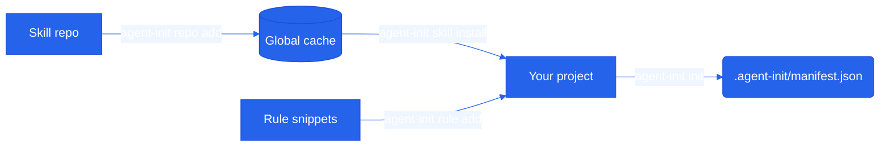

<p align="center">
  
</p>

<h1 align="center">agent-init</h1>

<p align="center">
  A CLI and TUI that scaffolds agent-engineering projects with shared rules, skills, and per-project instructions.
</p>

<p align="center">
  
  
  
  
</p>

## Why this exists

Most agent-engineering projects start with copy-pasted instructions, drifting rule files, and skills installed by hand. `agent-init` turns that into versioned, reproducible project state: one committed manifest, reusable rules, and skills pinned to a tag and SHA. Your AI assistant gets the right context from day one, and it stays the same on every fresh clone.

## Features

- **Generate `AGENTS.md` plus mirrored instructions** for Claude, Gemini, and more from a single managed template.
- **Manage reusable rule snippets** and mark the ones you always want as defaults, so every new project seeds them automatically.
- **Register skill source repos globally**, then install, update, and roll back skills with per-skill version pinning.
- **Keep the source of truth in your repo** via `.agent-init/manifest.json`; rollback works even on a fresh clone.
- **Use the TUI or the CLI** — pick the workflow that fits the moment.

## Quick start

Prerequisites: `uv` is installed.

```sh
# Add a rule snippet and make it a default.
agent-init rule add be-concise --body "Be concise." --default

# Scaffold a project: writes AGENTS.md + CLAUDE.md/GEMINI.md mirrors and seeds the default rule.
agent-init init path/to/project

# Register a skill source repo (https, ssh, or file://).
agent-init repo add anthropic https://github.com/anthropics/skills

# Browse, search, and install skills.
agent-init skill list
agent-init skill search review
agent-init skill install anthropic/code-review

# Or open the TUI.
agent-init tui
```

## Installation

Run without installing:

```sh
uvx --from git+https://github.com/jasperginn/agent-init.git agent-init --version
uvx --from git+https://github.com/jasperginn/agent-init.git agent-init tui
```

Install permanently as a `uv` tool:

```sh
uv tool install git+https://github.com/jasperginn/agent-init.git
```

For local development:

```sh
git clone https://github.com/jasperginn/agent-init.git
cd agent_init
uv sync
uv run agent-init --version
```

> **Platform note:** v0.1 supports macOS and Linux. Windows is not supported in this release.

## How it works



Per-project state lives in `.agent-init/manifest.json` and is committed to your repo. It pins installed skills to a `(tag, sha)` pair and keeps the last 10 versions in `history`, so rollback is reliable on a fresh clone.

Global state lives under [platformdirs](https://platformdirs.readthedocs.io/):

- `user_data_dir`: SQLite cache of registered repos, indexed skills, templates, and rule metadata.
- `user_cache_dir/repos/<alias>`: bare git mirrors (`git clone --mirror`), reused across projects.
- `user_cache_dir/snapshots/<alias>/<sha>/<skill>`: extracted skill bytes, used by rollback when the upstream SHA is no longer reachable.
- `user_config_dir/rules`: user-authored rule snippets (one markdown file per rule).

The global SQLite DB is treated as a cache. The project `manifest.json` is the source of truth.

### Skill discovery convention

A registered repo must expose at least one skill at one of these paths (precedence high → low):

1. `skills/<name>/SKILL.md`
2. `.claude/skills/<name>/SKILL.md`
3. `<name>/SKILL.md` at repo root
4. `SKILL.md` at repo root (the repo alias becomes the skill name)

Skills are referenced everywhere as `<repo_alias>/<skill_name>`. Repos with no discoverable skills are rejected on `repo add` unless you pass `--allow-empty`.

### Versioning

Skill versions are pinned as `<tag>+<short_sha>` when a tag both contains the skill at that revision and is at or after the skill's last-touching commit; otherwise the pin is SHA-only. On `update`, the resolver only attaches a tag when the install honestly reflects it.

### Safety properties

- `repo add` rolls back cleanly on indexing failure: no orphan registrations.
- `git archive | tar` extraction surfaces git's `stderr` first; `tar` errors are never misattributed.
- Snapshots write a `.agent-init.complete` sentinel; partial extractions are re-run on next access.
- `skill update` refuses to overwrite hand-edits to the deployed target directory (compares `content_hash`); use `--force` to override.
- `init` warns when it overwrites in-region content that was edited by hand since the last write.
- `repo rename` rewrites the SQLite registry and skill index atomically; if the on-disk clone move fails, the DB rename is rolled back.
- Rollback prefers the local snapshot; if both snapshot and upstream are gone, it errors out loudly rather than silently no-op'ing.

## See it in action

<p align="center">
  
</p>

The demo above shows the TUI: searching skills, installing one into a project, and initializing a project with the generated instructions.

## Development

```sh
uv run pytest          # full suite — 100+ tests, including TUI Pilot + snapshot tests
uv run ruff check .    # lint
uv run agent-init tui  # launch the TUI

pytest tests/tui --snapshot-update  # only after intentional visual changes
```

## Contributing

Open an issue or pull request on [GitHub](https://github.com/jasperginn/agent-init). For questions or ideas, start a discussion in the repo.
