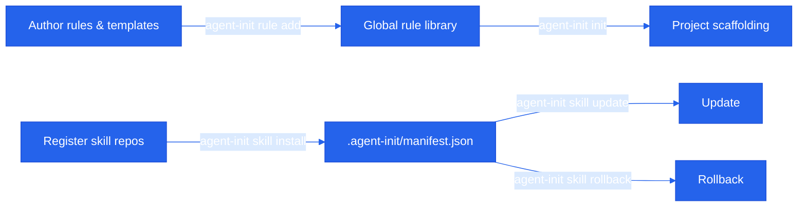

<p align="center">
  
</p>

<!-- Theme: Tech Innovation | Accent: #2563eb -->

<h1 align="center">agent-init</h1>

<p align="center">
  A small CLI + TUI for scaffolding agent-engineering projects.
</p>

<p align="center">
  
  
  
  
</p>

## Why agent-init exists

Every AI-native project needs the same scaffolding: an `AGENTS.md` file, model-specific mirrors, a shared set of rules, and a way to install reusable skills. Doing this by hand is repetitive and hard to keep consistent across repositories.

**agent-init turns that setup into a reproducible, version-pinned workflow.** Define your rules once, register skill sources, and let every new project inherit the same baseline with one command.

## Features

- **Project scaffolding** — generates `AGENTS.md` with mirrored instructions for Claude, Gemini, and other agents.
- **Reusable rule library** — author rule snippets once, mark defaults, and auto-seed them into every new project.
- **Skill registry** — register any git repo as a skill source, then install, update, and rollback skills with per-skill version pinning.
- **Source-of-truth manifest** — per-project state lives in `.agent-init/manifest.json`, so rollbacks work on a fresh clone.
- **TUI + CLI** — prefer a guided interface? Run `agent-init tui`. Prefer scripts? Use the same commands in your terminal.

## Quick start

```sh
# 1. Add a default rule snippet.
agent-init rule add be-concise --body "Be concise." --default

# 2. Initialize a project: writes AGENTS.md + CLAUDE.md/GEMINI.md mirrors.
agent-init init path/to/project

# 3. Register a skill source repo.
agent-init repo add anthropic https://github.com/anthropics/skills

# 4. Search and install a skill into the current project.
agent-init skill search review
agent-init skill install anthropic/code-review

# 5. Use the TUI for a guided experience.
agent-init tui
```

## Install

The recommended way to run `agent-init` is via `uvx`:

```sh
uvx --from git+https://github.com/jasperginn/agent-init.git agent-init --version
uvx --from git+https://github.com/jasperginn/agent-init.git agent-init tui
```

Install permanently as a `uv` tool:

```sh
uv tool install git+https://github.com/jasperginn/agent-init.git
```

For local development:

```sh
git clone https://github.com/jasperginn/agent-init.git
cd agent_init
uv sync
uv run agent-init --version
```

**Status:** v0.1 — macOS / Linux only. Windows is not supported in this release.

## How it works



Per-project state lives at `.agent-init/manifest.json` (committed to your repo). It pins installed skills to a `(tag, sha)` pair and keeps the last 10 versions in `history` so rollback works on a fresh clone too.

Global, machine-local state lives under [platformdirs](https://platformdirs.readthedocs.io/):

- `user_data_dir`: SQLite cache of registered repos, indexed skills, templates, and rule metadata.
- `user_cache_dir/repos/<alias>`: bare git mirrors (`git clone --mirror`), reused across projects.
- `user_cache_dir/snapshots/<alias>/<sha>/<skill>`: extracted skill bytes, used by rollback when the upstream SHA is no longer reachable.
- `user_config_dir/rules`: user-authored rule snippets (one markdown file per rule).

The global SQLite DB is treated as a **cache**. The project's `manifest.json` is the **source of truth** for what's installed where.

## Skill discovery convention

A registered repo must expose at least one skill at one of these paths (precedence high → low):

1. `skills/<name>/SKILL.md`
2. `.claude/skills/<name>/SKILL.md`
3. `<name>/SKILL.md` at repo root
4. `SKILL.md` at repo root (the repo alias becomes the skill name)

Skills are referenced everywhere as `<repo_alias>/<skill_name>`. Repos with no discoverable skills are rejected on `repo add` (pass `--allow-empty` to override).

## Versioning

Skill versions are pinned as `<tag>+<short_sha>` when a tag both (a) contains the skill at that revision and (b) is at or after the skill's last-touching commit; otherwise SHA-only. On `update`, the resolver only attaches the tag when the install honestly reflects it.

## Safety properties

- `repo add` rolls back cleanly on indexing failure: no orphan registrations.
- `git archive | tar` extraction surfaces git's stderr first; `tar` errors are never misattributed.
- Snapshots write a `.agent-init.complete` sentinel; partial extractions are re-run on next access.
- `skill update` refuses to overwrite hand-edits to the deployed target directory (compare `content_hash`); use `--force` to override.
- `init` warns when it overwrites in-region content that was edited by hand since the last write.
- `repo rename` rewrites the SQLite registry and skill index atomically; if the on-disk clone move fails, the DB rename is rolled back.
- Rollback prefers the local snapshot; if both snapshot and upstream are gone, it errors out loudly rather than silently no-op'ing.

## Demo

<p align="center">
  
</p>

## Development

```sh
uv run pytest          # full suite — currently 100+ tests, including TUI Pilot + snapshot tests
uv run ruff check .    # lint
uv run agent-init tui  # launch the TUI

pytest tests/tui --snapshot-update  # only after intentional visual changes
```

## Contributing

Bug reports and pull requests are welcome. Use the [issue templates](.github/ISSUE_TEMPLATE) to report bugs or propose features.
